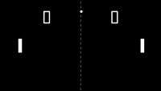

# Pong
Por Alejandro García Sosa

## Descripción del proyecto:
En este proyecto para la asignatura **Creando Interfaces de Usuario** (en adelante **CIU**) se ha desarrolado un Pong, con el objetivo principal de adaptarse al uso de processing.

La interfaz consiste en un fondo básico, consistente en un *background* negro, una línea blanca discontinua, la cual está formada por varias líneas cortas; los marcadores de cada jugador, creados con displays 7-segmentos, los cuales están formados por líneas blancas que se dibujan o no dependiendo del valor a mostrar; y una pelota y las 2 palas, cuya posición varía con el tiempo.

El control de las palas son las teclas **W Y S** para el Jugador 1 y las flechas **ARRIBA Y ABAJO** para el Jugador 2. La posición se actualiza en cada frame, y cuando las palas llegan a los límites de la pantalla, detienen su movimiento.

El movimento de la pelota está determinado por dos parámetros, y están configurados para que la pelota se mueva en un ángulo de **(2x+1)\*45 grados**, siendo **x** un número entero. Al incio del juego, la pelota aparecerá sobre la líne central, a una altura aleatoria, y se dirigirá aleatoriamente hacia uno de los lados. Al tocar los bordes superior e inferior, o con las palas, rebotará. Si en cambio toca los bordes laterales, se reiniciará su posición, cambiando su dirección hacia el jugador que ha marcado, y se sumará 1 a ese jugador. Cuando un jugador llega a 9 puntos, se acaba la partida.

## Diseño interno:
Internamente, la posición de las palas está almacenada en una variable, al igual que la dirección en la que se mueven. Al mantener pulsado **W** o **ARRIBA**, la variable de movimiento de la pala elegida se colocará a -1, con lo cual subirá un pixel cada frame. Con **S** y **ABAJO**, se colocará a 1, con lo que bajarán un pixel por frame. Al levantar un botón, ambas variables de movimento se ponen a 0, de forma que se evita que al levantar el botón las palas sigan moviendose. En cambio, la pelota tiene 2 variables de cada tipo, una para el eje X y una para el eje Y. 
Para el marcador, hay un método que redirige a los métodos que dibujan los números usando displays 7-segmentos, los cuales dibujan un número en una posición indicada, centrados en mitad del campo de cada jugador.

## Diseño de la interfaz:
Se ha procurado mantener la estética del juego original lo máximo posible, de ahí el uso de displays 7-segmentos para los marcadores, y el uso úncamente del fondo negro con elementos blancos. El sonido que suena con los rebotes ha sido elegido por la relativa similitud al original, por la longitud y, en menor medida, por gusto personal. La elección de los controles es para mantener un equilibrio entre ambos jugadores, de forma que ambos tengan las mismas posibilidades de ganar.

## Resultado en GIF:

## Bibliografía:
- Diapositivas de la asignatura de CIU.
- https://www.openprocessing.org/
- Sonidos: http://freewavesamples.com/
